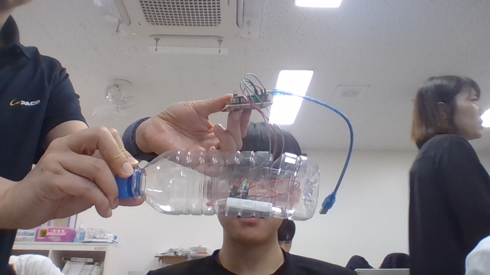

# 🌱 에코아트 프로젝트: [작품명]

## 📖 프로젝트 개요
- **제작자**: 김민서
- **제작일**: 7월16일
- **소개**
> 바다에 많이 버려지는 쓰레기들이 많기때문에 플라스틱을 재활용을 하기위해 랜턴을 만들었다

## 📦 사용 재료
페트병,LED,그림 도안

## 🔧 제작 과정

### 1단계: 아이디어 스케치

- 아이디어 설명
- 예상 완성도

### 2단계: 완성품

WIN_20250716_14_12_33_Pro.jpg
## 💭 제작 후기
### 잘된 점
- 생각보다 쉽게 내가 생각한대로 완성을 했다

### 아쉬운 점
- 생각보다 불빛이 약하다

### 개선할 점
- 불빛을 더 밝게 하고싶다

### 내가 이미 알고 있었던 것
- 많은 양의 플라스틱이 버려진다는것

### 새롭게 배운게 된 것
- 전자기기를 더 많이 배우고 안것같다

### 더 알고 싶은 것
- 불빛을 더 밝게하는법을 알고싶다

## 🌍 환경적 의미
- 이 작품이 환경에 미치는 긍정적 영향
- 사용한 재활용 재료가 환경에 미치는 의미
- 앞으로의 환경 보호 다짐 등

## 📚 참고 자료
- [환경 관련 웹사이트](링크)
- [참고한 에코아트 작품](링크)

## 🏷️ 태그
#에코아트 #재활용 #환경보호 #DIY #창의활동

---

> 이 프로젝트는 환경 보호와 창의적 사고를 위한 교육 목적으로 제작되었습니다.
